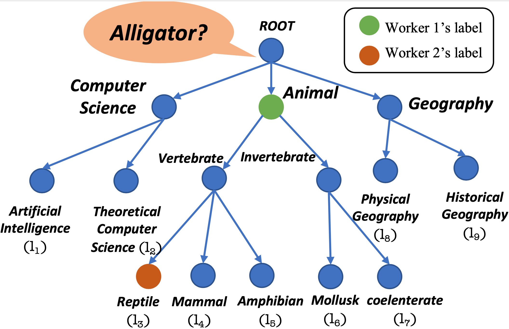

# ECTE: Expertise-aware Crowdsourcing Taxonomy Enrichment



Source code for WISE 2021 paper "Expertise-aware Crowdsourcing Taxonomy Enrichment"

> Is an alligator a reptile or an amphibian?

ECTE is a system for Taxonomy Enrichment by crowdsourcing.
Given a fixed taxonomy and 1 million instances (e.g. alligator),
ECTE provides a Tornado-based system
for hundreds of workers to annotate these instances to the taxonomy.
In addition, ECTE provides a quality control algorithm to save budget.

## Install

ECTE is tested on Ubuntu 18.04, with Python 3.6.9 .

```
python3 -m venv .venv
. .venv/bin/activate
pip install -r requirements.txt
```

## Usage

### Data Preparation

We provide an example of our data format in folder `platform/example`.

As a requester, there are 2 inputs for ECTE, namely a taxonomy `T` and a set of instances `I`.
In our example, `T` is defined in `example/science_class.json` and `I` is defined in `example/instances.txt`.
Instances in `I` can be devided into 2 groups, namely one group with gold answers and the other group without gold answers.
These instances are stored in `problem` table of `example/example.db`.
The first group of instances are used to estimate user skills with the algorithm described in the paper, with non-null `gold_answer` in table `problem`.
The other group of instances are unknown instances to be labeled, with null `gold_answer` in table `problem`.

To evaluate of our algorithm, all instances are provided a gold answer in `example/instances.txt`.
These gold answers are hidden for the algorithm.
If your task do not need to evaluate, you can comment out `self.eval()` in `Recommender` and provide an empty `example/instances.txt`.

### Run Server

```
cd platform
python server.py --db=example/example.db --port=8008 --bc=example/business_config.json
```

